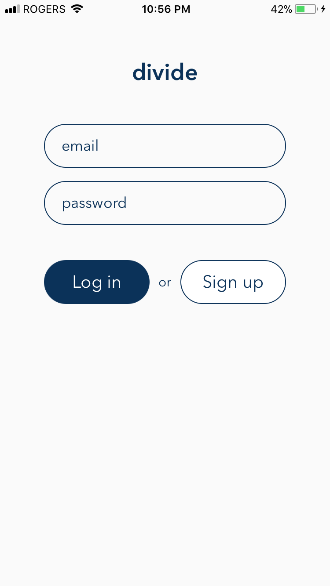
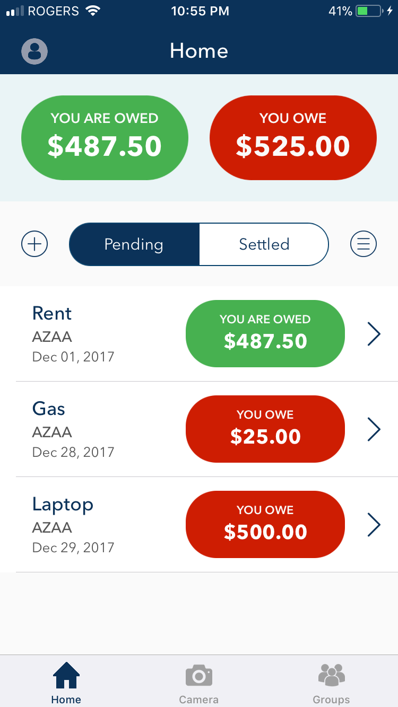
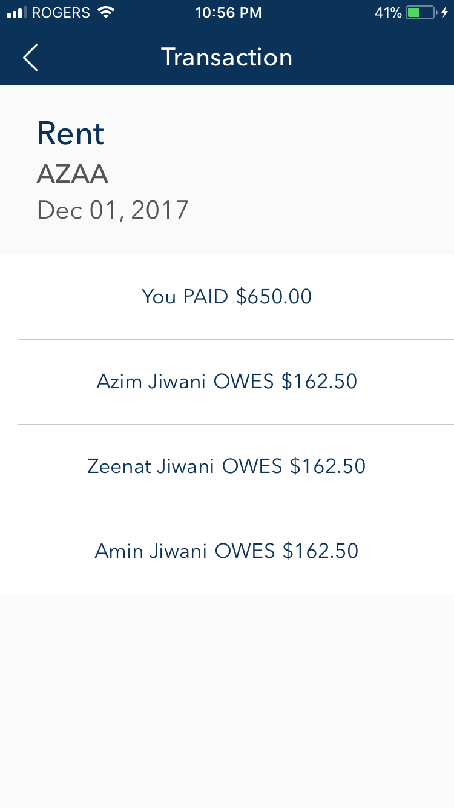
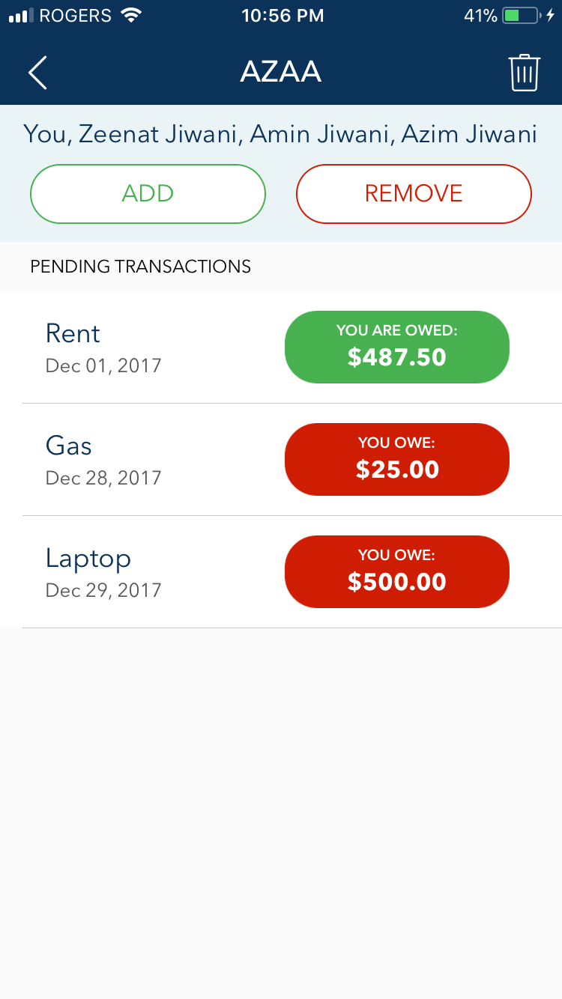
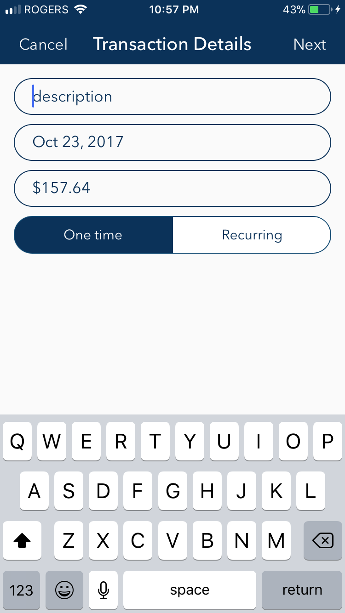

# divide
Ever been through the tedious process of splitting a bill between friends? Imagine if you could just take a picture of the receipt and settle the payment in seconds? 

Say hello to divide.

Divide is an iOS app which simplifies the process of splitting a bill with your friends. You can either manualy enter the receipt details (boring) or you can take a picture of the receipt and divide will look for the date and the amount. Once you create the transaction, your friends will be able to easily pay you back through the app using PayPal.

Check all your transactions on the home page.

View a breakdown of each transaction.

Check all the transactions in your group.

Take a picture of a receipt and make sure the date and the total are visible.

Divide will use OCR and NLP to read your receipt

### Tools used
- Firebase
- Optical Character Recognition using Tesseract
- Natural Language Processing
